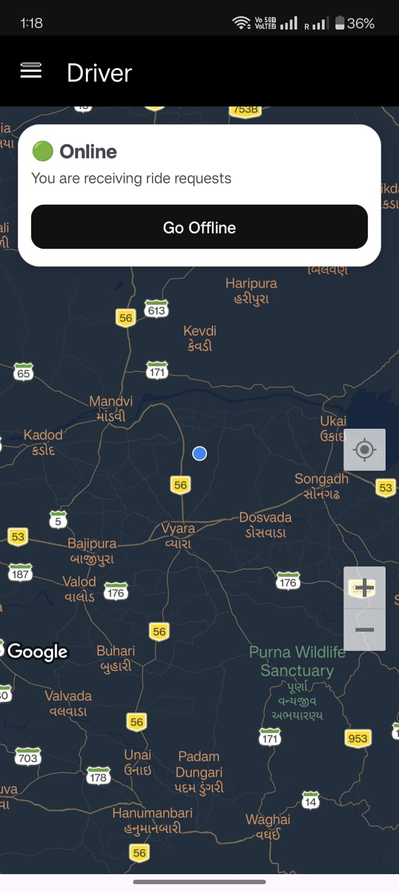
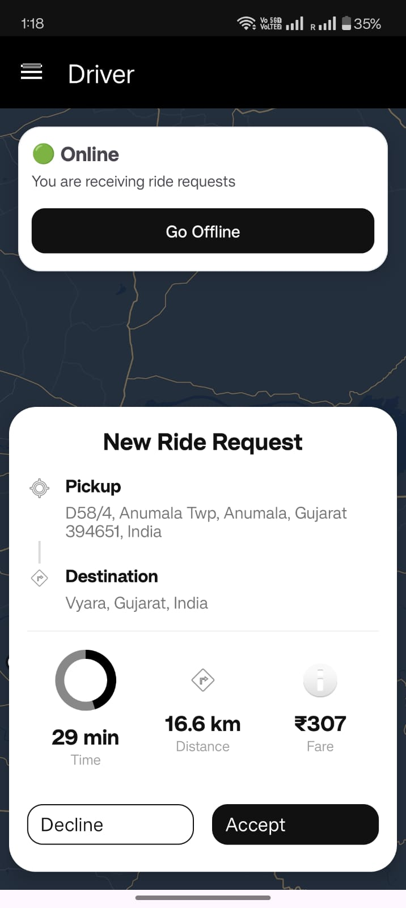
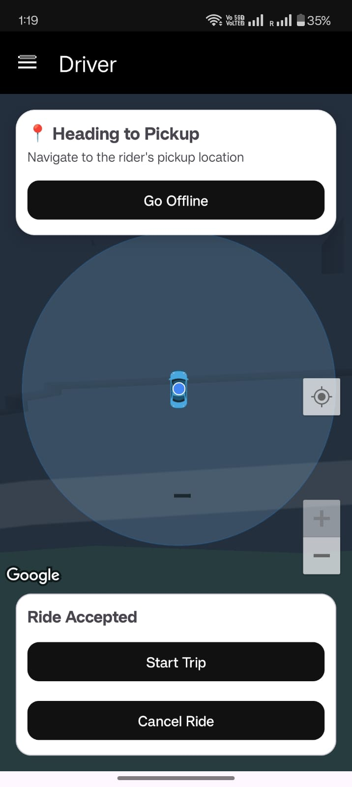
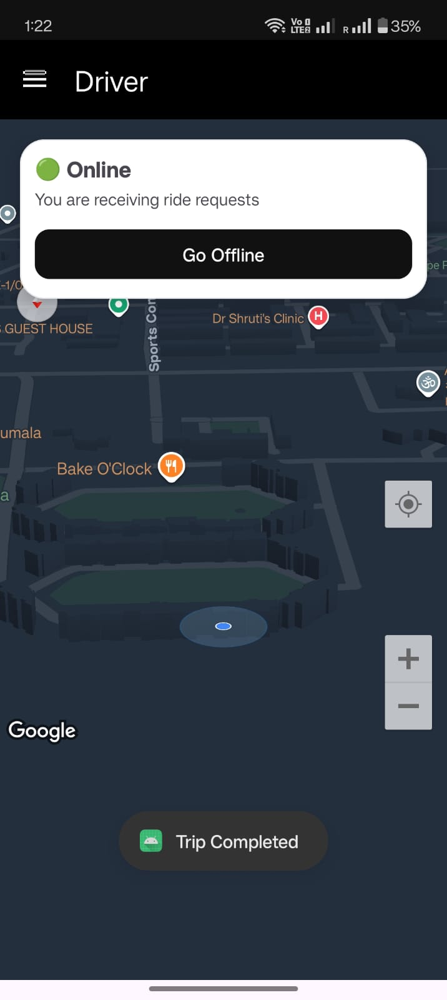
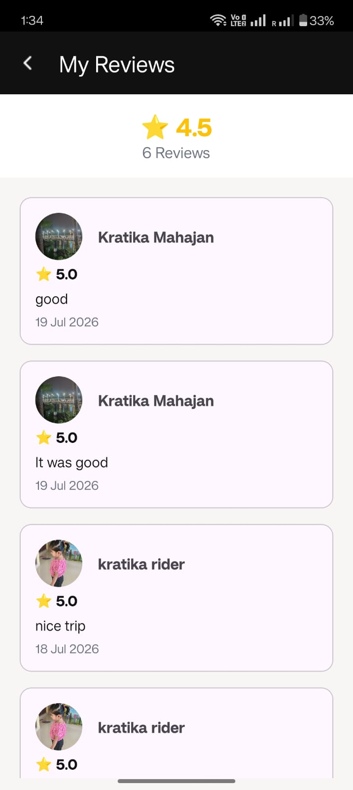
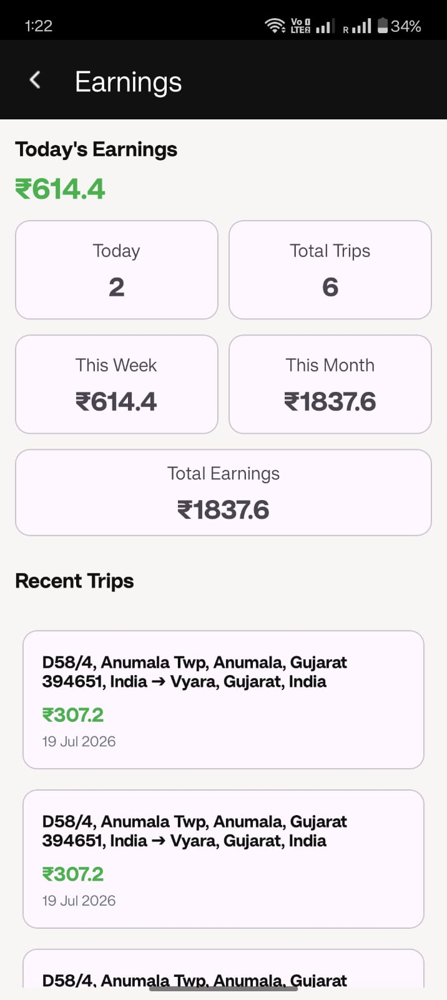
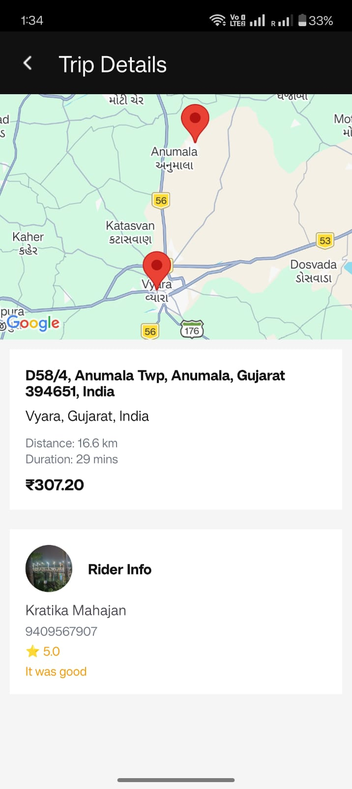

# 🚗 Driver Uber Clone

A modern Uber-like Driver Android application built using **Kotlin**, **Firebase**, **Google Maps SDK**, **GeoFire**, and **Firebase Cloud Functions**.

This application allows drivers to:
- Register and login using Phone Authentication
- Go online/offline to receive ride requests
- Accept or decline ride requests
- Navigate to the rider's pickup location
- Start and complete trips
- Update their live location in real time

This project demonstrates real-time driver management using Firebase Realtime Database, GeoFire, Google Maps, and Firebase Cloud Functions. It focuses on production-like features such as live location tracking, ride request management, push notifications, and trip lifecycle handling.

## ✨ Features

### 🔐 Authentication
- Phone Number Authentication using Firebase
- Automatic login session management
- Splash screen authentication flow

### 🟢 Driver Availability
- Go Online / Offline
- Real-time availability updates
- Driver busy status management

### 🚖 Ride Management
- Receive nearby ride requests
- Accept or decline ride requests
- View rider pickup and destination
- Navigate to pickup location
- Start trip
- Complete trip

### 🗺️ Maps & Navigation
- Google Maps integration
- Current location tracking
- Live route to pickup location
- Route to rider destination
- Real-time location updates

### 🔔 Notifications
- Firebase Cloud Messaging (FCM)
- Firebase Cloud Functions
- Incoming ride request notification
- Trip cancellation notification
- Trip completion notification

### ⭐ Driver Experience
- Rider information display
- Trip details
- Earnings-ready trip flow

### 📶 Reliability
- Internet connectivity monitoring
- GPS availability handling
- Runtime permission handling
- Firebase error handling

## 🛠️ Tech Stack

### Language
- Kotlin

### Android
- Android SDK
- AndroidX
- Material Design Components
- Fragments & Activities

### Google Services
- Google Maps SDK
- Google Places API
- Google Directions API

### Firebase
- Firebase Authentication
- Firebase Realtime Database
- Firebase Cloud Messaging (FCM)
- Firebase Cloud Functions

### Libraries
- Retrofit
- GeoFire
- EventBus

### Development Tools
- Android Studio
- Git
- GitHub

## 🏗️ Architecture

```text
                    Rider App
                         │
              Creates Ride Request
                         │
                         ▼
          Firebase Realtime Database
                         │
                         ▼
            Firebase Cloud Functions
                         │
                         ▼
         Firebase Cloud Messaging (FCM)
                         │
                         ▼
                    Driver App
                         │
                  Accept / Decline
                         │
                         ▼
          Firebase Realtime Database
                         │
                         ▼
             Live Driver Location
                         │
                         ▼
                    Rider App
```

## 📱 Application Screenshots

### 🚗 Driver Dashboard

| Home | Ride Request |
|------|--------------|
|  |  |

### 🗺️ Navigation & Trip

| Heading to Pickup | Trip Completed |
|-------------------|----------------|
|  |  |

### ⭐ Reviews & Earnings

| All Reviews | Earnings |
|-------------|----------|
|  |  |

### 📋 Trip Information

| Trip Detail |
|-------------|
|  |

## 💡 Challenges Solved

- Implemented real-time driver location updates using GeoFire.
- Built a ride request workflow with accept and decline functionality.
- Integrated Firebase Cloud Functions for push notifications.
- Managed driver online/offline availability in real time.
- Synchronized trip status between Rider and Driver applications.
- Handled GPS availability, internet connectivity, and runtime permissions.
- Designed a complete trip lifecycle from ride request to trip completion.

---

## 🚀 Future Improvements

- MVVM Architecture
- Hilt Dependency Injection
- Room Database for offline caching
- In-app turn-by-turn navigation
- Driver earnings analytics
- Unit and UI testing

---

## ▶️ How to Run

1. Clone the repository.
2. Open the project in Android Studio.
3. Add your `google-services.json` file.
4. Configure Firebase Authentication.
5. Enable Google Maps, Places, and Directions APIs.
6. Build and run the application.

---

## 👩‍💻 Author

**Kratika Kushwah**

Android Developer

- Kotlin
- Java
- Firebase
- Google Maps

